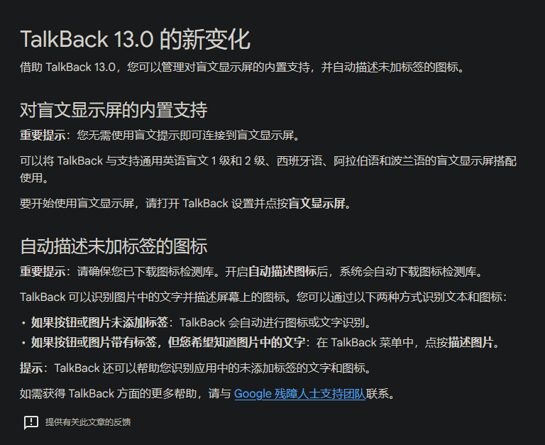

为什么要做super app?
因为预期super app 的Ax tree 的结构比原生安卓应用差很多，导致agent-use在mini app的效果差

mini app 比 app 差

微信渲染层 为什么差
原因可能太零碎了

安卓app的差异

解决方法：
talkback 工程实现

1. adb 获取无障碍树 可以完成
2. 获得第三方小程序的微信渲染层输入 
3. 找盲人调研： 
up 你好，我是上海科技大学的硕士研究生。想向你请教一些无障碍体验实际使用感受。  
你平时使用手机 App、电脑网站或小程序时，读屏软件等无障碍功能的支持情况怎么样？具体哪些网站、App 或小程序的无障碍体验比较差？例如：读屏顺序混乱、按钮或元素缺少名称、信息播报不完整、无法正常操作等。  
我们尤其关注支付宝、微信及其小程序的使用体验。如果你方便的话，想请你分享一些具体案例或遇到的问题。非常感谢你的帮助！
弹窗关闭
二级页面，全球购特别多，延迟
页面滚动有声音
不断滚动的页面
